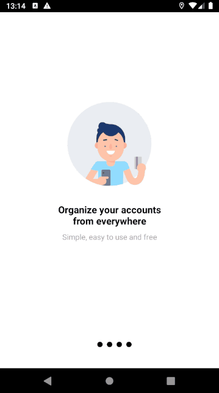

# MUney

The **MUney** is an application to help with your money organization.
This is the final project of my graduation on Systems Analysis and Development.
To create this app, it has been used MVVM + Clean Architecture, View Binding, Dagger Hilt for DI, Jetpack Navigation and more.
MUney is currently using Firebase as backend.

